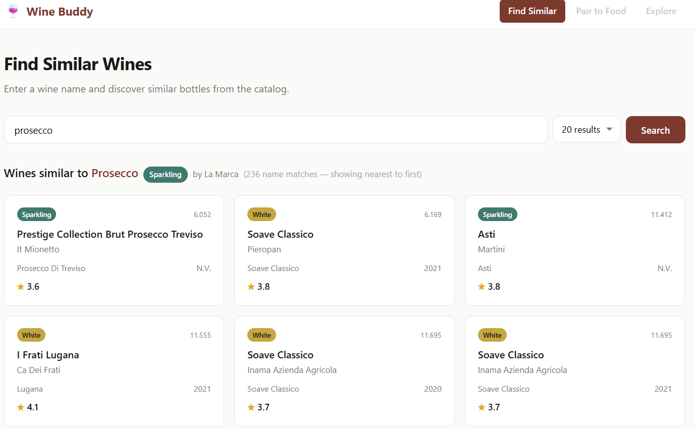

# Wine Buddy

Wine analysis project featuring similarity search, recommendations, and rule-based food pairing — all powered by machine learning.



## Features

1. **Data Gathering** — Scraper for collecting wine data (taste profiles, ratings, grapes, regions) from Vivino's public API
2. **Data Preparation** — Parse nested JSON fields, handle missing values, feature engineering
3. **Find Similar Wines** — KD-Tree nearest neighbor search on wine embeddings (PCA/LDA/NCA)
4. **Wine Recommendations** — Collaborative filtering via scraped user ratings
5. **Wine & Food Pairing** — Rule-based engine matching wine taste profiles to food characteristics

## Setup

```bash
uv sync
```

## Usage

### Web portal

```bash
uv run python -m uain.web.app
```

Then open [http://localhost:5000](http://localhost:5000).

### CLI

```bash
# Find wines similar to a given name
uv run wine-buddy find-wine-like amarone -n 10

# Find wines that pair with a food
uv run wine-buddy pair-wine-to steak -n 10
```

### Notebook

```bash
uv run jupyter lab
```

Then open `uain/wine_buddy.ipynb`.

### Scraping your own data

No pre-scraped data is included. The notebook contains scraper functions you can run to collect your own dataset. Please respect Vivino's Terms of Service and rate-limit your requests.

## Development

```bash
uv sync --dev
uv run pre-commit install
```

Pre-commit runs ruff lint + format, trailing whitespace, end-of-file, and large file checks on every commit.

## Privacy

For details on data collection and privacy practices, see [PRIVACY.md](PRIVACY.md).

## Credits

- Food pairing logic inspired by [RoaldSchuring/wine_food_pairing](https://github.com/RoaldSchuring/wine_food_pairing)
- Wine sweetness references: [Wine Folly](https://winefolly.com/deep-dive/the-prosecco-wine-guide/), [Handy Wine Guide](https://handywineguide.com/wine-sweetness-chart/)
